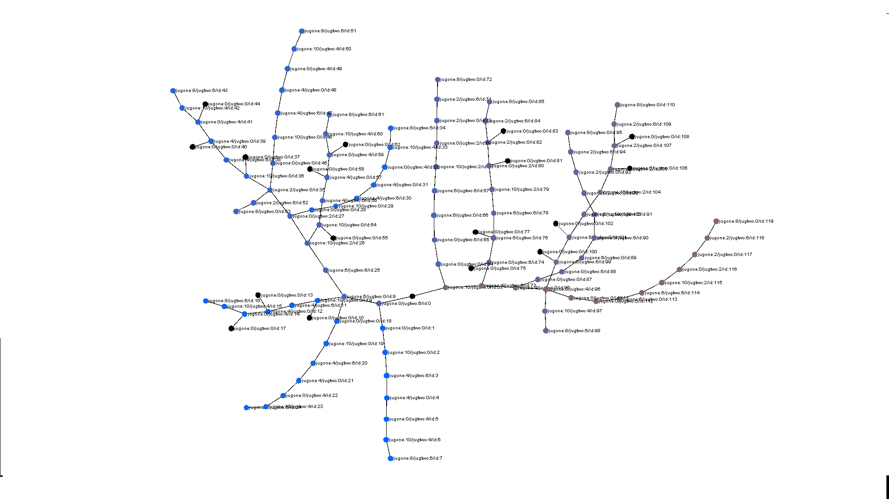

# JugTree-Problem

This code piece just uses some methods in order to make the water in the first jug as 8. Initially first jug and second jug are full which are 10 litre and 6 litre. The user cannot know how much water is in each jug. User can empty a jug, fill a jug fully, or move water from another jug without losing any water but (s)he can do it one at a time. The program solves this problem using the semantic nets in Artificial Intelligence. Then it visualizes it with a graph. The basic data structure is a tree which is implemented by Scalified's Tree. The graph has been created with GraphStream. 

Check out Scalified Tree:https://github.com/Scalified/tree

Check out GraphStream's gs-core:https://github.com/graphstream/gs-core

